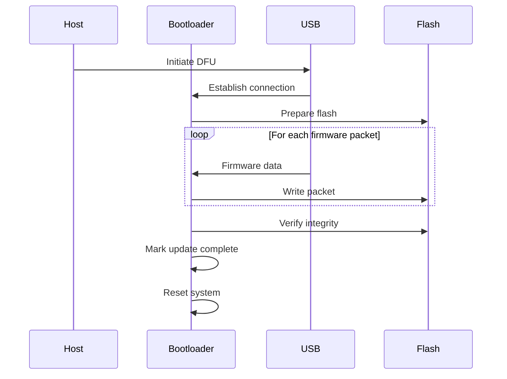
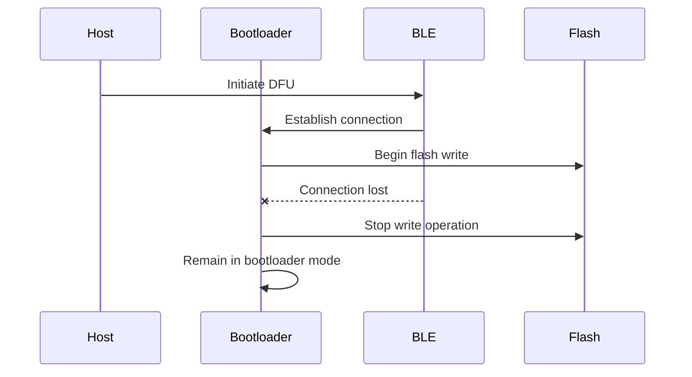
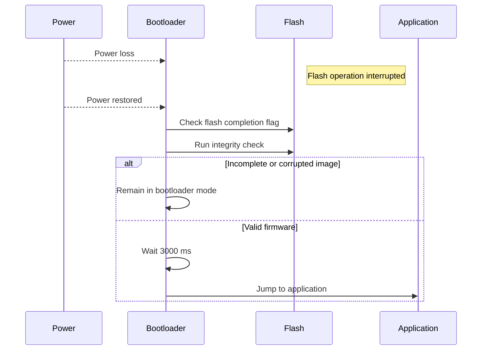

# 1. Key Sequence Diagrams

## SD-1: System Start-up and Boot Decision
```mermaid
sequenceDiagram
    participant Power
    participant Bootloader
    participant Button
    participant Flash
    participant Application

    Power-->>Bootloader: Power On / Reset
    Bootloader->>Button: Monitor button input (3000 ms)
    Bootloader->>Flash: Check flash completion flag
    Bootloader->>Flash: Run integrity check

    Double press detected
        Bootloader->>Bootloader: Enter Bootloader Mode
    else Integrity check failed
        Bootloader->>Bootloader: Remain in Bootloader Mode
    else No button press and integrity OK
        Bootloader->>Application: Jump to application
    end
```

---

## SD-2: Firmware Update over USB


---

## SD-3: Firmware Update over BLE with Connection Loss


---

## SD-4: Recovery After Power Loss During DFU


---

# 2. Traceability Matrix

| Requirement | Statechart Element(s) | Sequence Diagram(s) | Test ID |
|------------|------------------------|----------------------|---------|
| R-1 Wired update | BootloaderMode, DFU_USB | SD-2 | T-1 |
| R-2 Wireless update | BootloaderMode, DFU_BLE | SD-3 | T-2 |
| R-3 Double press entry | BootloaderMode | SD-1 | T-3 |
| R-4 Portability | DFU Abstraction Layer | SD-2, SD-3 | T-4 |
| R-5 Flash completion check | Boot decision | SD-1, SD-4 | T-5 |
| R-6 Firmware integrity | Boot decision | SD-1, SD-4 | T-6 |
| R-7 Application entry timeout | ApplicationMode | SD-1 | T-7 |
| R-8 Transport agnostic DFU | DFU Logic | SD-2, SD-3 | T-8 |

---

# 3. Test Plan

The following tests are design-level tests and do not include implementation details.

## T-1: Firmware Update over Wired Connection
Related Requirements: R-1  
Purpose: Verify firmware update over USB  
Expected Outcome: Device boots updated firmware

## T-2: Firmware Update over Wireless Connection
Related Requirements: R-2  
Purpose: Verify firmware update over BLE  
Expected Outcome: Device boots updated firmware

## T-3: Bootloader Entry via Double Button Press
Related Requirements: R-3  
Purpose: Verify manual bootloader entry  
Expected Outcome: Device enters bootloader mode

## T-4: DFU Transport Abstraction
Related Requirements: R-4, R-8  
Purpose: Verify transport-agnostic DFU design  
Expected Outcome: Shared DFU API is used

## T-5: Flash Completion Status Enforcement
Related Requirements: R-5  
Purpose: Prevent execution of incomplete firmware  
Expected Outcome: Device remains in bootloader mode

## T-6: Firmware Integrity Check on Boot
Related Requirements: R-6  
Purpose: Prevent execution of corrupted firmware  
Expected Outcome: Device remains in bootloader mode

## T-7: Automatic Application Entry Timeout
Related Requirements: R-7  
Purpose: Verify normal boot path  
Expected Outcome: Device enters application mode

## T-8: Connection Loss During DFU
Related Requirements: R-2, R-8  
Purpose: Verify safe behavior on connection loss  
Expected Outcome: Device remains in bootloader mode

---

# 4. Gap and Risk Analysis

- Integrity check correctness is critical  
- Button timing accuracy affects boot selection  
- Power loss during flash erase is a key risk  
- BLE DFU limited by RAM constraints  
