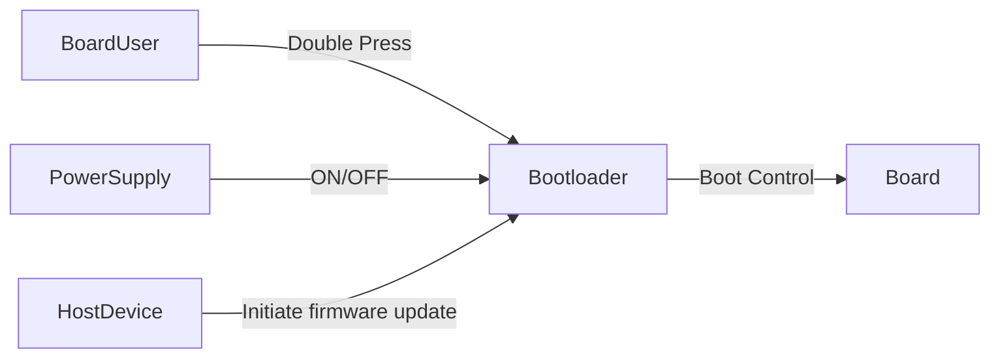
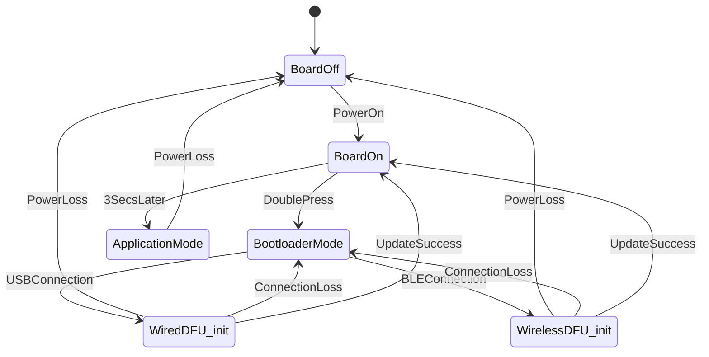

## System Boundary

### Inside the System
-  Boot selection logic
-  Firmware updation logic
-  Firmware validation logic
-  Bootloader

### Outside the System
-  Push button
-  Board User
-  Power supply
-  USB firmware update provider (laptop/desktop)
-  Bluetooth firmware update  provider (smartphone/laptop)

### Assumptions

-  Button can be pressed twice to enter bootloader
-  Power loss can occur at any time
-  Connection loss to USB device can happen at any time
-  Connection loss to bluetooth device can happen at any time

---

## System Context

### Actors and Interfaces

| Actor / Entity | Type | Interface Description |
|---------------|------|-----------------------|
|Board User                        |User                                           |Selects application/bootloader                                        |
|Power Supply                        |System                                           |Power presence/loss                                        |
|Host Device                        |User                                           |Provides firmware updates                                        |
|Push Button                        |Sensor                                           |Double press to enter bootloader(DFU) mode                                       |

---

### System Context Diagram

## Selected Use Cases

| ID   | Use Case          | Actor            | Description                                      |
| ---- | ----------------- | ---------------- | ------------------------------------------------ |
|UC-1        |Enter Bootloader               |Board User               |Press push button twice within 3000ms of reset/power on to enter bootloader                   |
| UC-2        |Update over USB connection               |Host Device               |Firmware update is sent by host device over USB when the device is in bootloader mode                   |
| UC-3        |Update over BLE connection               |Host Device               |Firmware update is sent by host device over BLE when the device is in bootloader mode                   |                  |
| UC-4        |Recover after power loss               |Power supply              |The device will boot as normal after the loss of power even if the power loss interrupted a firmware update                 |
| UC-5        |Firmware Updation completed               |  Host PC             | Exit bootmode by reset if DFU is completed                  |
---

### Use Case Descriptions

#### UC-1: Enter Bootloader
- Goal: Enter bootloader mode
- Trigger: User presses the push button twice within 3000ms of power on/reset.
- Main Scenario: Device detects double press → Enters bootloader mode → Waits for firmware update connection
- Outcome: System enters bootloader mode and awaits firmware update connection.
- Alternate Scenario: User does not double press push button → Device enters normal application mode

#### UC-2: Update over USB connection
- Goal: Update firmware over USB connection
- Trigger: Host device sends firmware update over USB connection when device is in bootloader mode.
- Main Scenario: Device is in bootloader mode→ Establishes connection with USB device→ Receives update from USB host device → Resets after successful firmware update
- Outcome: System resets afer successful firmware update
- Alternate Scenario: USB connection is interrupted during firmware update → Device continues in bootloader mode → Device can be manually reset without causing firmware corruption

#### UC-3: Update over BLE connection
- Goal: Update firmware over BLE connection
- Trigger: Host device sends firmware update over BLE connection when device is in bootloader mode.
- Main Scenario: Device is in bootloader mode→ Establishes connection with BLE device→ Receives update from BLE host device → Resets after successful firmware update
- Outcome: System resets afer successful firmware update
- Alternate Scenario: BLE connection is interrupted during firmware update → Device continues in bootloader mode → Device can be manually reset without causing firmware corruption

#### UC-4: Recover after power loss
- Goal: Recover normal operation after sudden power loss during firmware update
- Trigger: Power supply is cut off during software update
- Main Scenario: Device switches off during software update → Power is restored → Device validates firmware → Switches to valid firmware image → Executes valid firmware
- Outcome: System continues normal operation

#### UC-5 : Exit after Firmware Update completion
* Goal : After completing DFU system should start running application 
* Trigger : All  data packets are recieved and integrity is checked 
* Success scenario : System resets  
* Alternate scenario : System continues to wait  in bootmode
---

## UML Statechart (Behavioral Model)

---
## Safety and Error Handling (Behavioral View)
- System stays in bootloader mode on wired/wireless connection loss.
- Device boots as normal after power loss.
- Firmware validation is done to prevent loading corrupted firmware.

## Change Log
| Date | Change          | Author  |
| ---- | --------------- | ------- |
|      | Initial version | Example |
